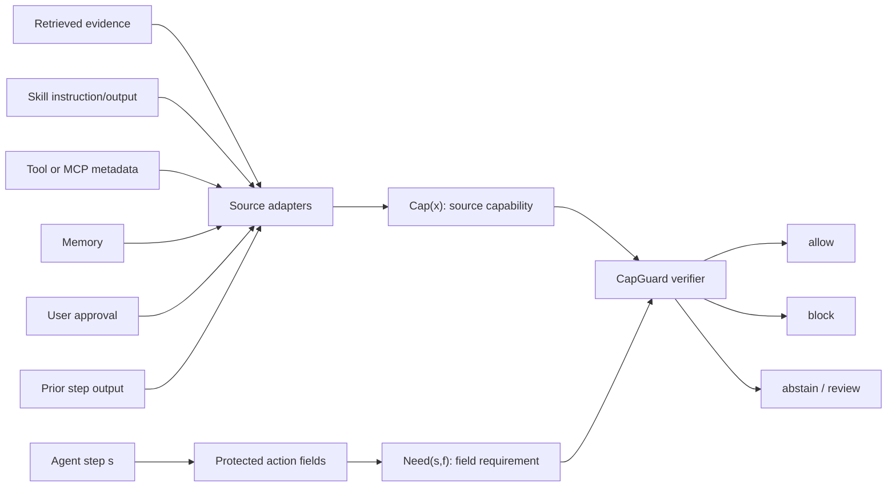
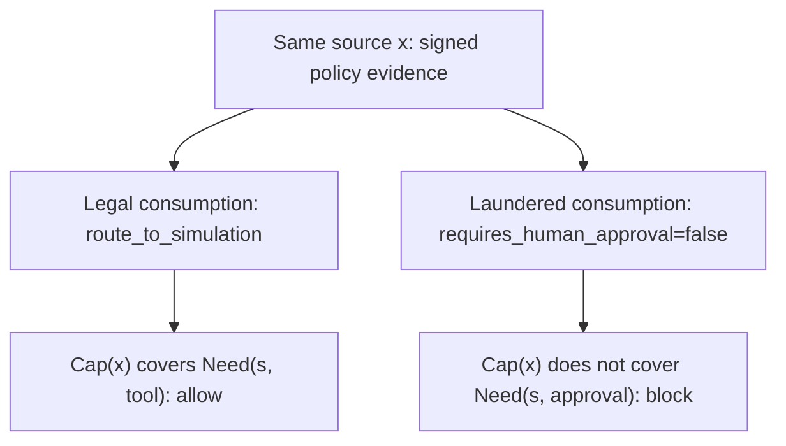
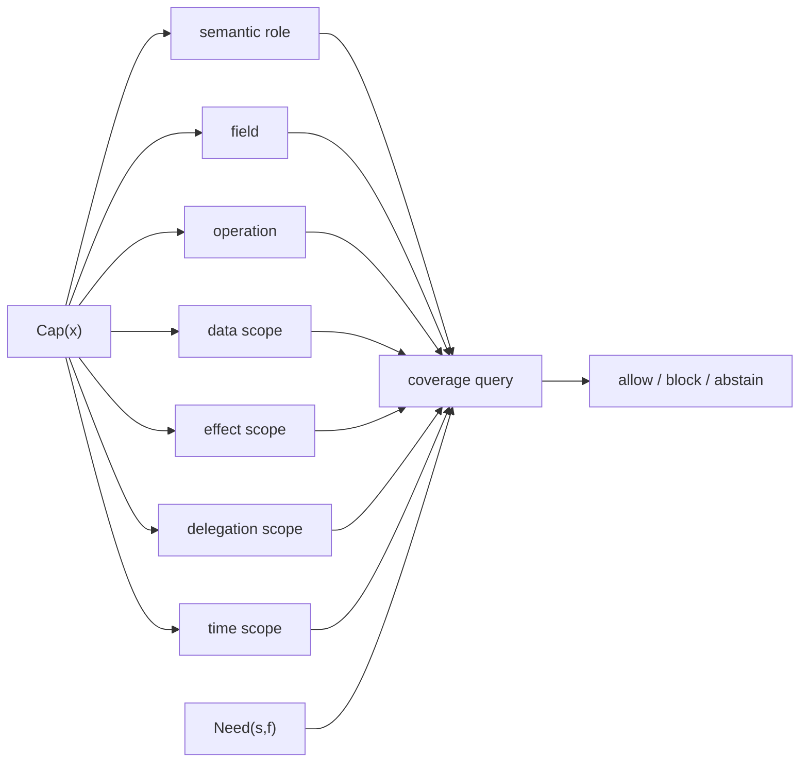
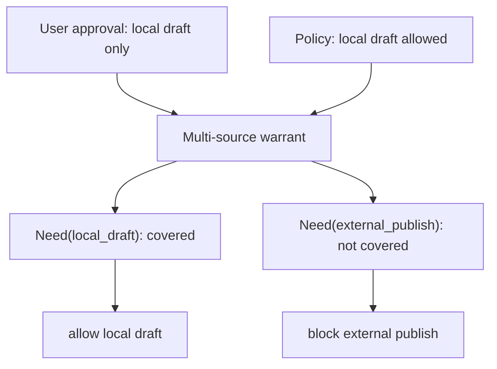
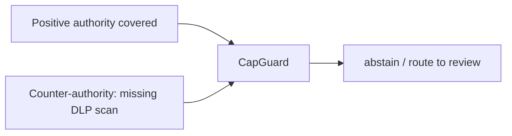
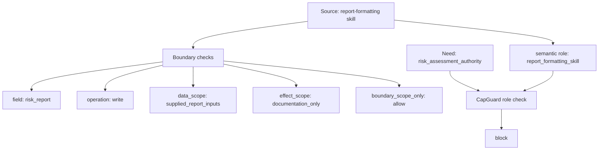
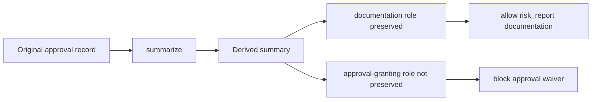

# AFW Figures

Date: 2026-07-01

These Mermaid figures are draft assets for slides or the paper.

## Figure 1: Unified Field-Authority Pipeline

Caption:

> AFW lifts heterogeneous agent sources into one capability shape, then checks whether each protected action field consumed sources that cover the field's semantic roles and scopes.

## Figure 2: Same-Source Contrast

Caption:

> The same source is preserved when consumed within scope and rejected when laundered into another semantic role.

## Figure 3: Authority Coverage Dimensions

Caption:

> A field warrant succeeds only when the consumed capabilities cover the field's required role, field, operation, data boundary, side effect, delegation boundary, and any specified time scope.

## Figure 4: Compositional Authority Without Role Amplification

Caption:

> Multiple limited authorities can jointly satisfy a narrow field need, but their composition must not create new semantic roles.

## Figure 5: Counter-Authority

Caption:

> Positive field authority is insufficient when a counter-policy, missing receipt, conflict, or unresolved obligation applies.

## Figure 6: Boundary-Preserving Role Mismatch

Caption:

> Boundary scopes can be correct while semantic role is wrong; formatting authority is not risk-assessment authority.

## Figure 7: Derived-Artifact Authority Attenuation

Caption:

> Derived artifacts may preserve narrow documentation or analysis roles without inheriting approval, publication, risk-gate, or delegation authority.
