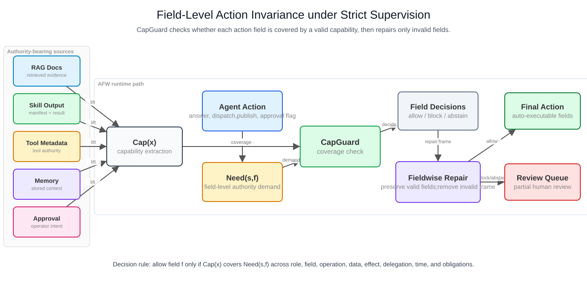
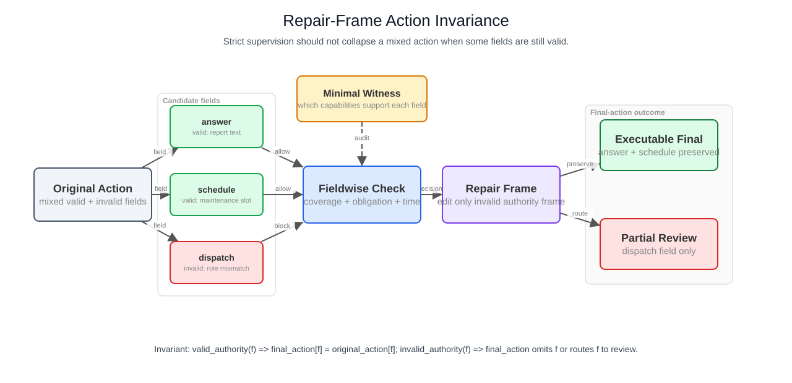
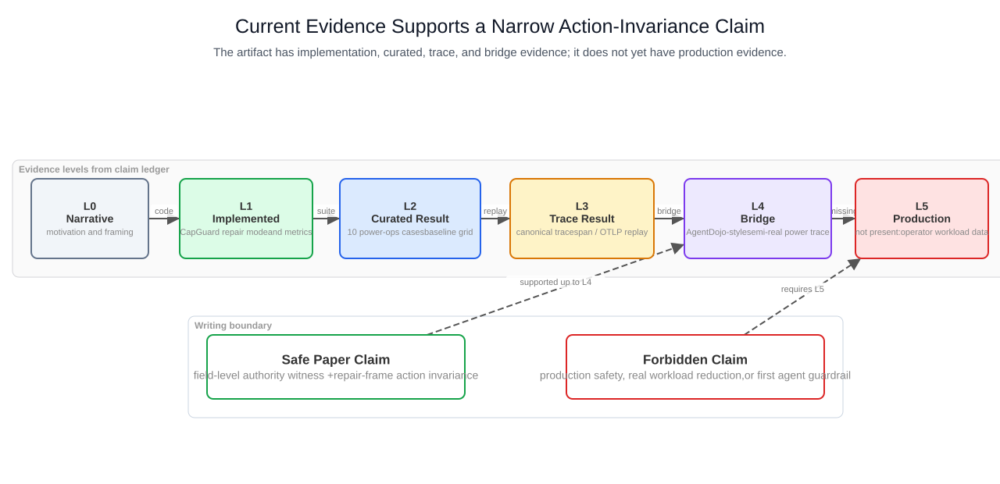

# Power-Ops Action Invariance Paper Kernel

## One-Sentence Kernel

We study field-level action invariance under strict LLM-agent supervision: a guard intervention should preserve authorized action fields, remove only fields without valid authority, and expose the residual review burden as auditable field-level evidence.

大白话版本：

> 电力 agent 的一个动作里，可能一半是正常工作，一半是越权操作。传统严格拦截会把整条动作打回，导致 agent 过于保守；我们要做的是只拿掉越权字段，把合法字段保留下来继续执行。

## Problem

电力大模型 agent 的风险不只在于“答错话”，而在于一个输出动作可能同时包含：

- 合法字段：回答、引用、格式化、生成工单草稿、安排低风险日程。
- 非法字段：调度指令、开关操作、审批绕过、隐私导出、风险等级强行改写。

严格策略监督通常会在发现非法字段后整动作阻断。这样安全，但会损失本来可以执行的合法部分。本文把这个问题抽象为：

```text
Under strict supervision, how can an agent preserve normal authorized behavior
while still removing unauthorized action fields?
```

## Core Formal Objects

### Capability

`Cap(x)` 表示来源 `x` 能授予什么能力。来源可以是 RAG 文档、skill manifest、tool metadata、memory、user approval、prior-step output 或 trace span。

一个 capability 至少包含：

- role scope
- field scope
- operation scope
- data scope
- effect scope
- delegation scope
- time scope
- obligations

### Need

`Need(s,f)` 表示 agent 在状态 `s` 下写入 action 字段 `f` 所需的授权。

字段级动作例子：

| Field | Meaning | Typical authority need |
|---|---|---|
| `answer` | answer or summary text | report/answer authority |
| `work_order` | work-order draft | maintenance drafting authority |
| `dispatch` | dispatch or switching action | dispatch authority |
| `public_publish` | external publication | publication approval + no active hold |
| `private_export` | private data export | privacy/data-export authority |

### Coverage Check

字段合法性的核心判断是：

```text
allow(s,f) iff exists x such that Cap(x) covers Need(s,f)
```

如果 coverage 缺失，输出 `block`；如果存在 counter-authority、过期 approval、缺 obligation 或证据不足，输出 `abstain` 或 `block`。

### Repair Invariant

fieldwise repair 的目标不是“绕过 guard”，而是让 guard 的干预更精细：

```text
valid_authority(f)   => final_action[f] = original_action[f]
invalid_authority(f) => final_action omits f or routes f to partial_human_review
```

换句话说，repair 只能修改 invalid authority frame，不能误删已经有授权的字段。

## Architecture



这张图对应当前实现路径：

```text
ExperimentRunner
  -> guardrail.afw_capguard
  -> evaluate.afw_runtime
  -> power_ops_action_invariance report helper
```

所有中间结果仍写入 `metrics`，没有新增顶层 `FormalTrustState` 字段。

## Fieldwise Repair



fieldwise repair 的论文叙事应聚焦三个点：

1. strict-block 安全但会造成 conservative collapse。
2. provenance-only 保留正常字段但会 false-allow 未授权字段。
3. fieldwise-repair 同时保留授权字段、移除未授权字段，并输出 partial review。

## Current Evidence Boundary



当前证据最高到 L4 bridge：

| Level | Current status |
|---|---|
| L1 implemented | CapGuard `fieldwise_repair` 与 action-invariance reporter 已实现 |
| L2 curated result | 10-case power-ops suite 与 baseline grid |
| L3 trace result | canonical trace、span log、OTLP replay、trace-import fixture、multi-step source-chain import |
| L4 bridge | AgentDojo-style fixture 与 semi-real power trace fixture |
| L5 production evidence | 尚无真实生产 trace 或 operator workload 数据 |

因此论文可以写“artifact-level / curated / trace-fixture evidence”，不能写“生产安全已证明”。

## Contributions

当前安全的 contribution 写法：

1. **Field-level authority formulation.** We formulate high-risk power-agent actions as structured fields and check whether source-derived capabilities cover each field's authority need.
2. **Repair-frame action invariance.** We define and implement a fieldwise repair mode that preserves authorized fields while removing or routing unauthorized fields to partial human review.
3. **FormalTrust artifact.** We implement the method in the existing AFW runtime path and expose final-action preservation, unsafe-field removal, repair validity, witness completeness, and review-burden metrics.
4. **Power-ops evaluation slice.** We evaluate curated power-operation cases, trace/span/OTLP fixtures, trace-import boundary cases, multi-step source-chain import, semi-real power traces, and AgentDojo-style bridge cases.

## Main Results

| Mode | Passed | Whole-action block rate | Executable repair success | Repair frame validity |
|---|---:|---:|---:|---:|
| strict-block | 10/10 | 1.000 | 0.000 | 1.000 |
| fieldwise-repair | 10/10 | 0.000 | 1.000 | 1.000 |
| trace-repair | 2/2 | 0.000 | 1.000 | 1.000 |
| span-otlp-repair | 2/2 | 0.000 | 1.000 | 1.000 |
| agentdojo-style | 2/2 | 0.000 | 1.000 | 1.000 |
| semireal-trace | 2/2 | 0.000 | 1.000 | 1.000 |
| expanded-fieldwise | 18/18 | 0.000 | 1.000 | 1.000 |
| metamorphic | 4/4 | 0.000 | 1.000 | 1.000 |
| skill-authority | 4/4 | 0.000 | 1.000 | 1.000 |
| trace-import | 4/4 | 0.000 | 1.000 | 1.000 |
| multistep-trace-import | 1/1 | 0.000 | 1.000 | 1.000 |

## Baseline Grid

| Baseline | Authorized final preservation | Unauthorized final removal | Whole-action block | Executable invariance | False allow fields |
|---|---:|---:|---:|---:|---:|
| strict-block | 0.000 | 1.000 | 1.000 | 0.000 | 0.000 |
| fieldwise-decision-only | 0.000 | 1.000 | 1.000 | 0.000 | 0.000 |
| provenance-only | 1.000 | 0.000 | 0.000 | 0.000 | 1.000 |
| fieldwise-repair | 1.000 | 1.000 | 0.000 | 1.000 | 0.000 |

## Performance Profile

| Profile | Normal preservation | Safety removal | Whole-action block | Review fields/case | Latency proxy | Audit compression |
|---|---:|---:|---:|---:|---:|---:|
| expanded-fieldwise | 1.000 | 1.000 | 0.000 | 1.000 | 36 | 0.500 |
| metamorphic | 1.000 | 1.000 | 0.000 | 1.000 | 8 | 0.688 |
| skill-authority | 1.000 | 1.000 | 0.000 | 1.000 | 8 | 0.500 |

Here "latency proxy" is the number of runtime field checks, not wall-clock latency.

## Safe Claim Boundary

可以写：

- On curated, trace-fixture, and trace-import cases, fieldwise repair preserves authorized final fields and removes unauthorized final fields.
- The artifact measures whole-action collapse, executable repair success, repair-frame validity, and review burden.
- The current result supports a narrow field-level action-invariance claim under strict supervision.

不能写：

- first LLM-agent guardrail
- first runtime enforcement framework
- solves prompt injection
- proves production safety
- reduces real operator workload
- outperforms AgentDojo or other official defenses

## Next Experiments

下一轮应继续扩证据，而不是扩大 claim：

1. 扩成 large-sample power-ops suite。
2. 做 action-invariance metamorphic tests。
3. 扩到 no-RAG 的 skill-driven agent security。
4. 做 latency / review-burden / over-conservatism 双轴评估。
5. 把 multi-step trace fixture 扩成 branching planner、memory write-back、skill-to-tool delegation 和真实/半真实 agent 日志导入，并测 wall-clock latency。
