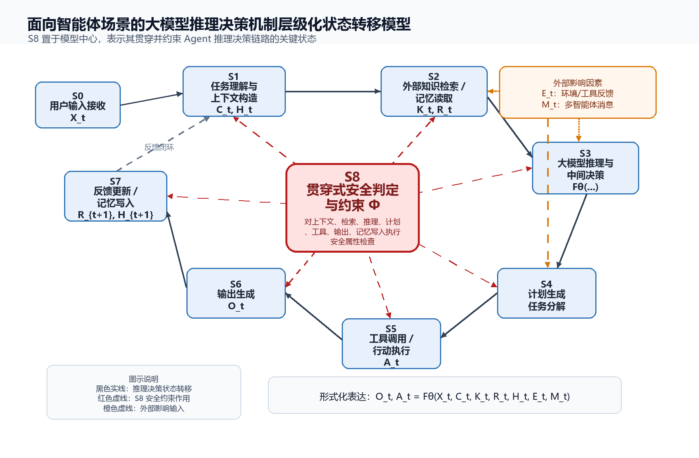

# 大模型安全相关技术调研报告（初稿）

聚焦研究点：1.1.1 大模型推理决策机制的形式化建模技术研究

## 研究摘要
本报告初稿围绕项目研究点 1.1.1“大模型推理决策机制的形式化建模技术研究”展开。当前阶段的核心任务不是开发完整软件系统，也不是立即构建沙盒或 LangGraph 工程，而是先建立能够支撑后续可信性测评、攻击测试和安全防护的理论与模型框架。

报告以大模型推理机制和 Agent 推理机制为起点，结合机理解释、智能涌现、状态空间建模、因果信息流和安全属性定义，提出“面向智能体场景的大模型推理决策机制层级化状态转移模型”。该模型以 S0-S7 表示 Agent 推理决策主链路，以 S8 表示贯穿式安全判定与约束节点，用于解释外部知识、记忆、工具、环境反馈和多智能体消息如何共同影响大模型决策行为。

## 1. 研究背景与问题定位
大模型在电力知识问答、运维辅助分析、规程检索和文档生成等场景中具有较强应用潜力，但其黑盒特性、上下文敏感性和生成式输出机制使决策过程难以解释。尤其在 Agent 场景中，大模型不再只是接收输入并生成文本，而是可能读取外部知识、调用工具、写入记忆、接收环境反馈，并与其他智能体交换消息。这使推理决策过程从单轮文本生成转变为多源信息驱动的动态状态演化过程。

因此，本阶段需要解决的核心问题是：如何在不直接建模全部 Transformer 参数的前提下，抽象出大模型及 Agent 的推理决策链路；如何定义状态、变量、动作、转移和安全属性；如何基于该模型定位提示注入、RAG 投毒、记忆污染、工具误调用、幻觉和敏感泄露等关键风险。

## 2. LLM 推理机制与机理解释调研
学术界通常通过提示方法和推理轨迹来描述 LLM 的推理行为。CoT 将复杂任务拆解为中间推理步骤，Self-Consistency 通过多条推理路径投票提升稳定性，ToT 和 GoT 将推理从单链扩展为树状或图状搜索，ReAct 将推理与行动交替组织，Reflexion 则强调模型可利用反馈进行反思和改进。这些研究说明，大模型的“推理”并不只是最终输出，而包括中间表示、候选路径、行动反馈和自我修正等过程。

机理解释研究从另一个角度揭示大模型的不可解释性。因果追踪、激活修补和表征分析尝试定位模型内部哪些激活或模块影响事实回忆和输出行为；智能涌现和上下文学习研究则说明，模型能力可能随规模、训练数据和提示形式发生非线性变化。对本项目而言，这些研究的启发是：第一节点不宜承诺精确解释全部参数和层间表征，而应把内部表征、参数记忆和注意力机制作为影响推理决策的底层因素，在 Agent 层面优先建立可观察、可验证的状态转移模型。

## 3. Agent 场景下推理机制变化
普通 LLM 的典型输入是用户问题和上下文，输出是文本结果。Agent 场景则增加了外部知识、记忆、工具、环境反馈和多智能体消息等影响因素。RAG 将外部知识 K_t 引入上下文，提升知识覆盖，但也引入检索污染和证据可信性问题；短期与长期记忆 R_t 使 Agent 能跨轮次保持信息，但也可能形成记忆污染和敏感信息泄露；工具调用 A_t 使模型从“说”变成“做”，带来越权、参数注入和外部副作用风险；环境反馈 E_t 会改变后续推理路径，使决策过程具有闭环性。

多智能体协同进一步改变推理机制。多个 Agent 可能承担规划、检索、执行、审查等不同角色，消息 M_t 在智能体之间传播。协同可以提高复杂任务处理能力，但也可能放大错误：一个 Agent 的错误归因、污染记忆或不安全建议可能被其他 Agent 接收、复述、强化，并在协同链路中形成跨 Agent 风险传播。因此，多智能体不宜只作为系统架构问题，而应被纳入推理决策机制模型。

## 4. 层级化状态转移模型
本报告建议采用“面向智能体场景的大模型推理决策机制层级化状态转移模型”。模型不把大模型视为单一黑箱输出器，而是将 Agent 执行链路抽象为状态集合 S、输入变量集合 X/C/K/R/H/E/M、动作集合 A、输出 O、转移函数 T 和安全属性集合 Phi。

核心决策函数可写为：O_t, A_t = F_theta(X_t, C_t, K_t, R_t, H_t, E_t, M_t)。其中 F_theta 表示大模型与 Agent 决策策略的组合，X_t 为当前用户输入，C_t 为上下文，K_t 为外部知识或检索内容，R_t 为记忆，H_t 为历史交互轨迹，E_t 为环境或工具反馈，M_t 为多智能体消息，O_t 为文本输出，A_t 为动作或工具调用。

S0-S7 表示主决策链路，S8 不是单独的末端节点，而是贯穿上下文构造、外部知识接入、计划生成、工具调用、输出生成和记忆写入等关键位置的安全判定机制。这样的设计能够避免把安全检查简化为最终输出过滤，并为后续风险定位和可信性测评提供状态依据。

图 1 将 Agent 推理决策过程建模为 S0-S7 主链路，并将 S8 设计为贯穿式安全判定与约束节点，用于表达安全属性 Phi 对上下文、检索、计划、工具、输出和记忆写入等关键环节的约束。

## 5. 安全属性与电力场景边界
安全属性 Phi 用于描述模型在不同状态下必须满足的安全行为边界。通用属性包括：不得输出危险或违规建议；不得泄露敏感信息、系统提示词或内部策略；外部检索内容不得覆盖系统安全指令；被污染记忆不得影响高风险决策；高风险工具调用前必须经过权限检查；攻击输入不应导致模型偏离原始任务目标；输出应与可信证据保持一致；安全约束不应显著损伤正常任务能力。

结合电力场景，本阶段增加“证据溯源要求”：电力知识问答和运维辅助建议必须能够关联可信资料、规程或检索证据；当证据不足、证据冲突或来源可信度不足时，模型不得给出确定性处置结论。第一节点以电力知识问答和运维辅助决策为应用示例，不研究实时调度、控制指令生成或自动化执行。

## 6. 攻击测试与可信性测评框架
攻击测试框架应从模型状态出发，而不是只从攻击名称出发。测试样本库记录场景、输入、攻击类型、目标状态、预期安全行为、预期风险、风险等级和判定标准；被测对象执行后记录上下文构造、检索内容、记忆读取、推理轨迹摘要、计划、工具调用、输出和记忆写入等关键字段；随后由 S8 安全判定机制判断是否违反安全属性，并计算指标。

本阶段指标体系重点服务两项项目考核目标：其一，安全攸关建模结果与模型实际输出在安全相关行为上的一致率达到 80% 以上；其二，潜在风险发现数量相比传统基准提高 10%。防护后风险下降至少 20% 和通用能力下降不多于 10% 属于后续防护验证指标，本阶段只保留口径，不展开具体防护算法。

## 7. 后续工作边界
本阶段不开展完整软件系统设计，不构建沙盒，不编写 LangGraph 工程方案，不设计数据库、API 或前端界面，也不展开具体安全防护算法。后续可基于本阶段模型和风险定位结果，进一步研究安全提示优化、外置防护模块、权限控制、记忆清洗、检索可信性过滤和防护效果验证。

当前阶段的完成标准是形成一份能够向老师说明研究逻辑的报告初稿：为什么要从推理机制出发，为什么 Agent 场景需要状态转移模型，模型如何定义状态和变量，安全风险如何从模型推出，可信测评指标如何对齐项目考核目标。

## 8. 四张核心表

### 表 1 文献调研任务表
| 调研方向 | 检索关键词 | 需回答问题 | 研究启发 |
| --- | --- | --- | --- |
| LLM 推理机制 | CoT, Self-Consistency, ToT, GoT, ReAct, Reflexion, LLM planning | LLM 的推理如何由中间步骤、分支探索、反思和行动反馈组织起来？ | 为 S3 推理、S4 计划和 S5 行动之间的关系提供理论基础。 |
| 机理解释与智能涌现 | Mechanistic Interpretability, Causal Tracing, Activation Patching, Emergent Abilities, In-context Learning | 黑盒性体现在哪里？内部表征、参数记忆、涌现能力与推理行为如何关联？ | 说明本阶段不直接建模全部 Transformer 参数，而是把内部表征作为影响因素和调研支撑。 |
| Agent 推理机制 | LLM-based Agent, Tool use, Memory-augmented Agent, RAG Agent, Agent workflow | Agent 相比普通 LLM 多了哪些信息源和行动环节？ | 支撑 S1-S7 主链路，突出 RAG、记忆、工具和环境反馈。 |
| 多智能体协同 | Multi-agent collaboration, AutoGen, CAMEL, agent communication, role-based agents | 多智能体消息如何改变任务分解、角色协同和错误传播路径？ | 将 M_t 作为扩展变量，分析跨 Agent 污染和协同目标偏移。 |
| 形式化建模 | State Transition System, FSM, Causal Graph, Information Flow Control, Formal Verification, Model Checking | 如何把 Agent 推理过程抽象为状态、动作、转移和安全属性？ | 支撑层级化状态转移模型与贯穿式安全判定 S8。 |
| 安全风险与可信测评 | Prompt Injection, RAG Poisoning, Tool Misuse, AgentHarm, SafetyBench, TrustLLM, OWASP LLM Top 10 | 哪些风险与推理决策链路直接相关？如何形成可测指标？ | 支撑 7 类关键风险、攻击测试框架和指标体系。 |

### 表 2 状态变量定义表
| 状态节点 | 状态含义 | 输入变量 | 动作/输出 | 安全关注点 |
| --- | --- | --- | --- | --- |
| S0 | 用户输入接收 | X_t | 记录用户任务、问题、约束或攻击输入 | 直接提示注入、越狱诱导、恶意任务伪装 |
| S1 | 任务理解与上下文构造 | X_t, C_t, H_t | 形成当前任务目标、指令优先级和上下文窗口 | 上下文污染、系统指令覆盖、目标偏移 |
| S2 | 外部知识检索 / 记忆读取 | K_t, R_t, H_t | 调用 RAG、知识库、短期/长期记忆 | RAG 投毒、检索劫持、记忆污染、记忆泄露 |
| S3 | 大模型推理与中间决策 | X_t, C_t, K_t, R_t, H_t, E_t, M_t | 形成中间判断、归因、候选答案或候选动作 | 幻觉、错误归因、证据不一致、目标劫持 |
| S4 | 计划生成 | C_t, K_t, R_t, H_t | 拆分任务步骤、确定行动顺序和工具策略 | 危险计划、错误任务分解、高风险操作路径 |
| S5 | 工具调用 / 行动执行 | A_t, E_t | 选择工具、传入参数、接收工具结果 | 越权调用、参数注入、工具误用、外部副作用 |
| S6 | 输出生成 | O_t, C_t, K_t, R_t | 生成用户可见文本、建议、报告或解释 | 敏感泄露、危险建议、系统提示泄露、幻觉输出 |
| S7 | 反馈更新 / 记忆写入 | H_t, R_t, E_t | 根据反馈更新历史轨迹或记忆 | 错误记忆写入、自我强化、跨会话污染 |
| S8 | 贯穿式安全判定与约束 | Phi, S_t, A_t, O_t | 在上下文、检索、计划、工具、输出、记忆写入等关键点执行安全判定 | 漏报、误报、风险等级错误、策略绕过 |

### 表 3 关键风险映射表
| 风险类型 | 对应状态 | 攻击方式 | 影响后果 | 可测指标 |
| --- | --- | --- | --- | --- |
| 提示注入 | S0/S1/S6 | 攻击者通过用户输入或外部文本混入冲突指令 | 改变任务目标、覆盖安全约束、诱导泄露或违规输出 | 攻击成功率 ASR、目标偏移率、拒答正确率 |
| RAG 投毒 | S2/S3/S6 | 污染检索语料或诱导检索命中低可信内容 | 错误证据进入上下文，导致幻觉或错误建议被包装为有依据 | 投毒命中率、证据一致率、风险发现数量 |
| 记忆污染 | S2/S7 | 将错误事实、偏置指令或敏感信息写入短期/长期记忆 | 污染后续推理，形成跨轮次或跨会话风险 | 记忆污染触发率、跨轮风险复现率 |
| 幻觉与错误归因 | S3/S6 | 模型在证据不足、证据冲突或上下文噪声下生成确定性判断 | 输出不可靠结论，影响电力知识问答和运维辅助判断 | 幻觉率、证据溯源失败率、事实一致率 |
| 工具误调用 | S4/S5 | 错误选择工具、越权传参或把不可信内容转化为工具参数 | 产生外部副作用、访问越权资源或执行不应执行的动作 | 工具误调用率、权限检查覆盖率、参数异常率 |
| 敏感信息泄露 | S2/S6/S7 | 诱导模型泄露系统提示、内部策略、检索内容或记忆中的敏感信息 | 暴露内部规则、业务数据或用户隐私 | 泄露率、敏感片段命中率、脱敏失败率 |
| 多智能体错误传播/感染 | S1/S3/S4/S7 | 一个 Agent 的错误消息、污染记忆或不当计划被其他 Agent 接收并放大 | 形成群体性错误归因、协同目标偏移或跨角色风险传播 | 跨 Agent 传播率、协同一致性错误率、风险节点定位准确率 |

### 表 4 测评指标体系表
| 指标名称 | 定义 | 计算口径 | 对应风险 | 项目指标关系 |
| --- | --- | --- | --- | --- |
| 形式化一致率 | 模型判定的安全相关行为与被测 Agent 实际输出/轨迹的一致程度 | 一致样本数 / 有效测试样本数 | 提示注入、幻觉、工具误调用、泄露 | 直接对齐 80% 建模一致率 |
| 风险发现数量 | 模型化测试框架发现的有效风险点数量 | 去重后的有效风险点计数 | 全部 7 类风险 | 支撑风险发现能力评估 |
| 风险发现提升率 | 相对传统基准新增或提升的风险发现能力 | (本方法风险数 - 基准风险数) / 基准风险数 | RAG 投毒、记忆污染、多智能体传播等传统基准覆盖不足风险 | 对齐风险数量提升 10% |
| 攻击成功率 ASR | 攻击样本导致目标安全属性被破坏的比例 | 成功攻击样本数 / 攻击样本总数 | 提示注入、RAG 投毒、工具误调用 | 用于衡量攻击测试框架有效性 |
| 风险节点定位准确率 | 测试框架定位的风险状态与人工标注状态一致的比例 | 定位正确样本数 / 已定位风险样本数 | 全部状态相关风险 | 说明模型能支持风险溯源 |
| 证据一致率 | 输出结论与可信检索证据一致的比例 | 证据一致输出数 / 需证据支撑输出数 | 幻觉、RAG 投毒、电力知识问答风险 | 落实电力场景证据溯源要求 |
| 敏感信息泄露率 | 输出或记忆写入中出现敏感信息的比例 | 泄露样本数 / 含敏感信息风险样本数 | 敏感泄露、系统提示泄露、记忆泄露 | 用于安全行为一致率和后续防护验证 |
| 工具误调用率 | 工具选择、权限、参数或调用时机错误的比例 | 误调用次数 / 工具调用总次数 | 工具误调用、越权调用 | 为后续权限控制和外置防护提供依据 |
| 通用能力下降率 | 安全约束或防护引入后正常任务能力下降比例 | (基准能力分 - 防护后能力分) / 基准能力分 | 防护副作用 | 本阶段预留，后续对齐下降不多于 10% |
| 防护后风险下降率 | 防护策略部署后风险问题下降比例 | (防护前风险数 - 防护后风险数) / 防护前风险数 | 全部可防护风险 | 本阶段预留，后续对齐下降至少 20% |

## 9. 需要老师确认的问题
1. 第一节点模型是否采用 Agent 推理决策状态模型为主，内部表征和参数机制作为调研支撑而不深入建模。
2. “传统基准”具体采用通用 LLM safety benchmark、项目自建基准，还是二者结合。
3. 电力场景是否以电力知识问答和运维辅助决策为主要示例，暂不进入调度/控制类场景。

## 参考文献与资料来源
[1] Wei 等，Chain-of-Thought Prompting Elicits Reasoning in Large Language Models. https://arxiv.org/abs/2201.11903
[2] Wang 等，Self-Consistency Improves Chain of Thought Reasoning in Language Models. https://arxiv.org/abs/2203.11171
[3] Yao 等，Tree of Thoughts: Deliberate Problem Solving with Large Language Models. https://arxiv.org/abs/2305.10601
[4] Besta 等，Graph of Thoughts: Solving Elaborate Problems with Large Language Models. https://arxiv.org/abs/2308.09687
[5] Yao 等，ReAct: Synergizing Reasoning and Acting in Language Models. https://arxiv.org/abs/2210.03629
[6] Shinn 等，Reflexion: Language Agents with Verbal Reinforcement Learning. https://arxiv.org/abs/2303.11366
[7] Schick 等，Toolformer: Language Models Can Teach Themselves to Use Tools. https://arxiv.org/abs/2302.04761
[8] Lewis 等，Retrieval-Augmented Generation for Knowledge-Intensive NLP Tasks. https://arxiv.org/abs/2005.11401
[9] Meng 等，Locating and Editing Factual Associations in GPT. https://rome.baulab.info/
[10] Wei 等，Emergent Abilities of Large Language Models. https://arxiv.org/abs/2206.07682
[11] Akyurek 等，What learning algorithm is in-context learning?. https://arxiv.org/abs/2211.15661
[12] Wang 等，The Rise and Potential of Large Language Model Based Agents: A Survey. https://arxiv.org/abs/2309.07864
[13] Park 等，Generative Agents: Interactive Simulacra of Human Behavior. https://arxiv.org/abs/2304.03442
[14] Wu 等，AutoGen: Enabling Next-Gen LLM Applications via Multi-Agent Conversation. https://arxiv.org/abs/2308.08155
[15] Shi 等，Prompt Injection attack against LLM-integrated Applications. https://arxiv.org/abs/2306.05499
[16] OWASP，Top 10 for Large Language Model Applications. https://owasp.org/www-project-top-10-for-large-language-model-applications
[17] Andriushchenko 等，AgentHarm: A Benchmark for Measuring Harmfulness of LLM Agents. https://arxiv.org/abs/2410.09024
[18] Zhang 等，SafetyBench: Evaluating the Safety of Large Language Models. https://arxiv.org/abs/2309.07045
[19] Huang 等，TrustLLM: Trustworthiness in Large Language Models. https://arxiv.org/abs/2401.05561
[20] Li 等，System-Level Defense against Indirect Prompt Injection Attacks: An Information Flow Control Perspective. https://arxiv.org/abs/2409.19091
